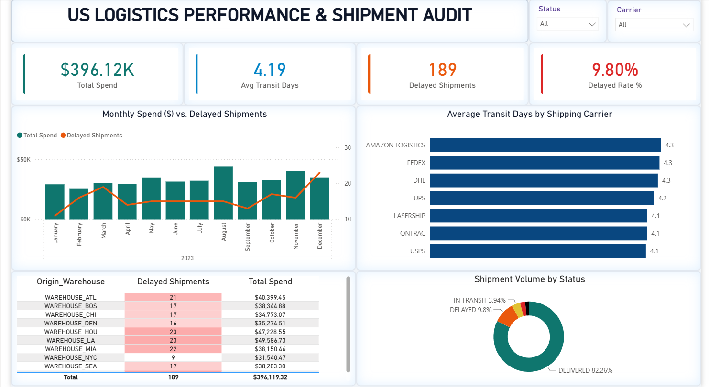

# US Logistics Performance & Shipment Audit Dashboard


An executive-level Power BI dashboard designed to monitor end-to-end logistics operations, audit shipping SLA compliance across carriers, and isolate regional supply chain fulfillment bottlenecks.

---

## Executive Summary & Visual Overview

[](https://app.powerbi.com/reportEmbed?reportId=e06cfb26-0361-4933-a338-60716d218670&autoAuth=true&ctid=a1b03033-8a3d-4443-a90b-0f3298ffbf90)
>👆 **Click the image above to open and interact with the live dashboard!** 
### Key Insights
- **Financial Footprint**: Tracked **$396.12K** in total logistics expenditure across **1,928 total shipments**.
- **Delivery Bottlenecks**: Identified an overall **9.80% delay rate** (189 delayed shipments) impacting fulfillment efficiency.
- **SLA Discrepancies**: Amazon Logistics, FedEx, and DHL logged the highest average transit times (**4.3 days**), while USPS, OnTrac, and LaserShip averaged **4.1 days**.
- **High-Risk Hubs**: `WAREHOUSE_LA` and `WAREHOUSE_HOU` recorded the highest volume of fulfillment delays (**23 delayed shipments each**).

---

## Architecture & Features

### 1. KPI Scorecard
- **Total Spend**: `$396.12K` aggregate transportation cost.
- **Avg Transit Days**: `4.19 days` fulfillment velocity benchmark.
- **Delayed Shipments**: `189` disrupted orders flagged for audit.
- **Delayed Rate %**: `9.80%` supply chain risk ratio.

### 2. Operational Analytics & Visuals
- **Monthly Spend vs. Delay Trends**: Dual-axis combination chart tracking total spend against shipment disruptions across the 2023 calendar year.
- **Carrier SLA Benchmark**: Horizontal bar chart comparing transit times across top carriers (Amazon Logistics, FedEx, DHL, UPS, LaserShip, OnTrac, USPS).
- **Warehouse Audit Matrix**: Ranked operational view highlighting warehouse delay volumes with soft conditional formatting gradients.
- **Status Volume Breakdown**: Donut chart capturing shipment status proportions (Delivered: **82.26%**, Delayed: **9.80%**, In Transit: **3.94%**, Lost: **2.33%**, Returned: **1.66%**).

---

## Data Model & DAX Formulas

The model is built on standard DAX measures optimized for performance and interactive filtering across carrier and status dimensions.

```dax
-- Total Financial Spend
Total Spend = SUM('US_Logistics'[Spend])

-- Average Order Transit Time
Avg Transit Days = AVERAGE('US_Logistics'[Transit_Days])

-- Delayed Shipment Volume
Delayed Shipments = 
CALCULATE(
    COUNTROWS('US_Logistics'),
    'US_Logistics'[Status] = "DELAYED"
)

-- Fulfillment Delay Ratio
Delayed Rate % = 
DIVIDE(
    [Delayed Shipments], 
    COUNTROWS('US_Logistics'), 
    0
)

-- On-Time / Delivery Fulfillment Rate
On-Time Rate % = 
DIVIDE(
    CALCULATE(
        COUNTROWS('US_Logistics'), 
        'US_Logistics'[Status] = "DELIVERED"
    ),
    COUNTROWS('US_Logistics'),
    0
)
